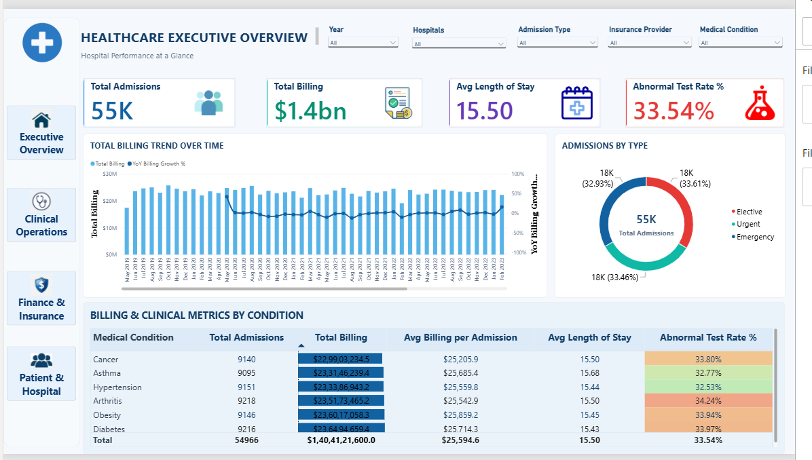

# Healthcare Admissions Analytics Dashboard

> Power BI portfolio project analyzing healthcare admissions, clinical operations, patient demographics, billing performance, insurance patterns, and data quality.



---

## 📌 Project Overview

This project presents an interactive healthcare analytics dashboard developed using Microsoft Power BI.

The objective is to transform raw healthcare admission data into meaningful business and operational insights through data cleaning, data modeling, DAX measures, and interactive visualizations.

The dashboard provides analysis across four key areas:

- Executive Overview
- Clinical Operations
- Finance & Insurance
- Patient & Admission Analysis

---

## 🎯 Project Objective

The project focuses on answering important analytical questions such as:

- How are healthcare admissions changing over time?
- Which medical conditions have higher admission volumes?
- What are the patterns in patient age, gender, blood type, and medication?
- How do admission types differ across patient groups?
- What is the billing performance across insurance providers?
- How does billing relate to length of stay?
- What proportion of test results are abnormal?
- How reliable is the billing data?

---

## 🛠️ Tools & Technologies

- Microsoft Power BI
- Power Query
- DAX
- Data Modeling
- Star Schema
- Data Visualization

---

## 🧹 Data Preparation

The original dataset contained **55,500 records** and **15 columns**.

The data preparation process included:

- Removed 534 exact duplicate records
- Cleaned and standardized text fields
- Converted date fields from text to Date type
- Rounded billing values to two decimal places
- Identified negative billing records as data-quality issues
- Created a `Billing_Flag` to distinguish valid and invalid billing records
- Created `LengthOfStay`
- Created `AgeGroup`
- Added `PatientRecordID` after deduplication
- Created dimension tables for medical condition and insurance provider
- Created a dedicated date dimension for time-based analysis

After cleaning, the dataset contained **54,966 records**.

---

## 🏗️ Data Model

The project follows a star-schema approach.

### Fact Table

- `Fact_Admissions`

### Dimension Tables

- `Dim_Date`
- `Dim_MedicalCondition`
- `Dim_Insurance`

The original healthcare dataset is retained separately for audit/reference purposes.

---

## 📊 Dashboard Pages

### 1. Executive Overview

Provides a management-level summary of:

- Total admissions
- Total billing
- Average length of stay
- Abnormal test rate
- Billing trends
- Admission types
- Medical condition performance

### 2. Clinical Operations Analysis

Focuses on:

- Length of stay
- Test-result distribution
- Age groups
- Admission types
- Medical conditions
- Abnormal test rates

### 3. Finance & Insurance Analysis

Focuses on:

- Total billing
- Average billing per admission
- Billing data quality
- Insurance provider performance
- Billing trends
- Billing vs. length of stay
- Medical-condition financial performance

### 4. Patient & Admission Analysis

Focuses on:

- Patient demographics
- Age groups
- Gender
- Blood type
- Medication
- Medical conditions
- Admission patterns
- Test results

---

## 📈 Key DAX Measures

Example measures used in the dashboard:

```DAX
Total Admissions =
COUNTROWS(Fact_Admissions)

Total Billing =
CALCULATE(
    SUM(Fact_Admissions[Billing Amount]),
    Fact_Admissions[Billing_Flag] = "Valid"
)

Avg Length of Stay =
AVERAGE(Fact_Admissions[LengthOfStay])


Valid Billing % =
DIVIDE(
    CALCULATE(
        COUNTROWS(Fact_Admissions),
        Fact_Admissions[Billing_Flag] = "Valid"
    ),
    COUNTROWS(Fact_Admissions),
    0
)

## Repository Structure
healthcare-admissions-analytics/
│
├── Dashboard/
│   └── Healthcare_Admissions_Dashboard.pbix
│
├── Documentation/
│   └── Healthcare_Admissions_Dashboard_Documentation.pdf
│
└── Screenshots/
    ├── 01_Executive_Overview.png
    ├── 02_Clinical_Operations.png
    ├── 03_Finance_Insurance.png
    └── 04_Patient_Admission_Analysis.png

### 📄 Documentation
Detailed project documentation covering the data preparation process, Power Query transformations, data model, DAX measures, dashboard design, validation, and analytical interpretation is available in the Documentation folder.

### ⚠️ Data Limitations
The dataset contains synthetic healthcare data.
Some categorical distributions are highly uniform, so the dashboard should be interpreted as a demonstration of analytical and visualization capabilities rather than as evidence of real-world healthcare population patterns.
Negative billing records were treated as data-quality issues because the dataset did not provide a transaction or adjustment reason.
Hospital names have very high cardinality, so they were not modeled as a separate analytical dimension.

### 👤 Author
Souvik Maity
B.Tech — Computer Science & Engineering (AI & ML)

⭐ This project demonstrates practical skills in **Power BI, Power Query, DAX, data cleaning, data modeling, and dashboard development**.
